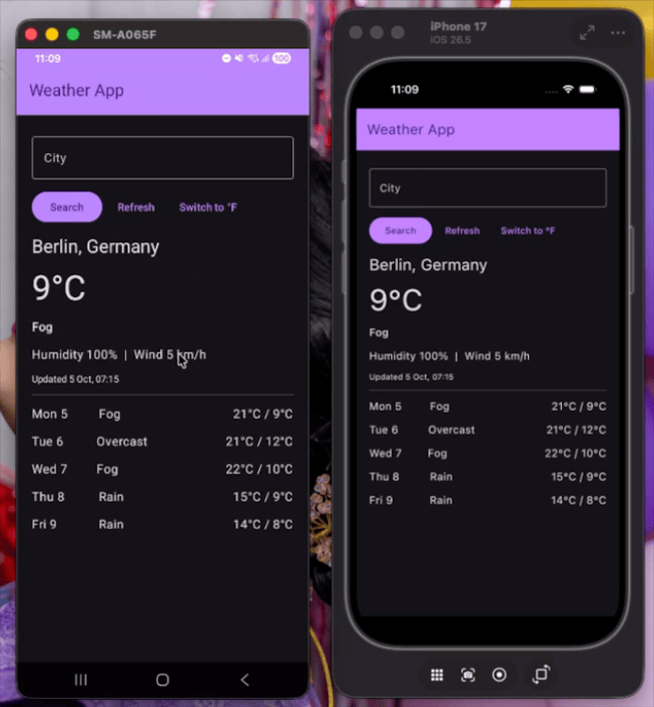

# Kotlin Multiplatform Weather App

## Overview

A small Kotlin Multiplatform app that shows the current weather and a 5 day forecast for any city.
Data comes from the free [Open-Meteo](https://open-meteo.com/) forecast and geocoding APIs (no API
key needed).

## Project Structure

- `shared`: Kotlin Multiplatform module (`commonMain`, `androidMain`, `iosMain`, `commonTest`).
    - `WeatherScreen` / `AppTheme`: the Compose Multiplatform UI, shared by both platforms.
    - `WeatherRepository`: Ktor client (timeouts, JSON, non-2xx treated as errors). Injectable for
      tests.
    - `WeatherStore`: shared presenter exposing a `StateFlow<WeatherUiState>` with `search`,
      `refresh` and `toggleUnit`.
    - `WeatherFormatter`: maps API models to display strings (units, dates, WMO weather codes).
    - `MainViewController` (`iosMain`): hosts the shared UI in a `UIViewController`.
- `androidApp`: thin shell, `MainActivity` and a `MainViewModel` that hosts the shared store.
- `iosApp`: thin SwiftUI shell that embeds the shared Compose UI.

## Features

- Search any city, default is Berlin.
- Current temperature, condition, humidity, wind and a 5 day forecast.
- Switch between °C and °F.
- Loading, error and retry states.

## Requirements

- JDK 17
- Android Studio (latest stable) for the Android app
- Xcode for the iOS app

## Build and Run

- Android: open the project in Android Studio and run the `androidApp` configuration, or
  `./gradlew :androidApp:assembleDebug`.
- iOS: open `iosApp/iosApp.xcodeproj` in Xcode and run.
- Tests: `./gradlew :shared:testDebugUnitTest`

## Demo

